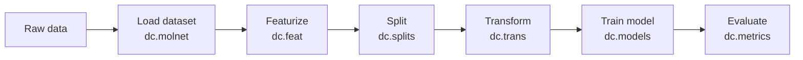

DeepChem is an open-source Python library that aims to democratize the use of deep learning across the life sciences. Built on top of PyTorch, TensorFlow, JAX, and scikit-learn, it provides a unified interface for loading molecular datasets, featurizing chemical structures, training graph neural networks and other deep learning models, and evaluating their performance—all without requiring expertise in low-level framework APIs. Whether you are predicting drug toxicity, modeling quantum chemical properties, or designing new materials, DeepChem's consistent pipeline reduces the time from raw data to trained model.

## What DeepChem provides

DeepChem version `2.8.1` exports the following top-level submodules, each covering a distinct part of the scientific machine learning workflow:

| Submodule | Purpose |
|---|---|
| `deepchem.data` | Dataset containers and loaders |
| `deepchem.feat` | Molecular and material featurizers |
| `deepchem.models` | Neural network and classical ML models |
| `deepchem.splits` | Train/validation/test splitters |
| `deepchem.trans` | Data transformers and normalizers |
| `deepchem.metrics` | Evaluation metrics and score functions |
| `deepchem.molnet` | Curated benchmark dataset loaders |
| `deepchem.rl` | Reinforcement learning utilities |
| `deepchem.dock` | Molecular docking interfaces |
| `deepchem.hyper` | Hyperparameter optimization |

## Pipeline overview

A typical DeepChem workflow follows a linear pipeline that mirrors the scientific process:

1. **Load** — `deepchem.molnet` provides one-line loaders for dozens of curated datasets such as Tox21, QM9, BBBP, and PDBbind.
2. **Featurize** — `deepchem.feat` converts SMILES strings, crystal structures, or protein sequences into numerical representations (Morgan fingerprints, graph features, Coulomb matrices, and more).
3. **Split** — `deepchem.splits` partitions data using random, scaffold, stratified, or time-based splitters to produce realistic train/validation/test sets.
4. **Transform** — `deepchem.trans` applies normalization, balancing, and other transformations to improve training stability.
5. **Train** — `deepchem.models` exposes graph convolutional networks, attention-based models, transformers, and classical ML wrappers behind a uniform `fit` / `predict` interface.
6. **Evaluate** — `deepchem.metrics` wraps sklearn and SciPy score functions (ROC-AUC, R², RMSE, and more) and integrates with DeepChem's `Dataset` objects.

## Key modules

<CardGroup cols={2}>
  <Card title="Data" icon="database" href="/concepts/datasets">
    `deepchem.data` provides `Dataset` containers—`NumpyDataset`, `DiskDataset`, and `ImageDataset`—that store features, labels, and sample weights together and support efficient batching.
  </Card>
  <Card title="Featurizers" icon="flask" href="/concepts/featurizers">
    `deepchem.feat` converts raw chemical inputs (SMILES, InChI, PDB files) into model-ready representations: molecular graphs, fingerprints, Coulomb matrices, and grid-based descriptors.
  </Card>
  <Card title="Models" icon="brain" href="/concepts/models">
    `deepchem.models` includes GCNModel, AttentiveFPModel, MPNNModel, GraphConvModel, and dozens of other neural architectures alongside scikit-learn and XGBoost wrappers.
  </Card>
  <Card title="MoleculeNet" icon="atom" href="/moleculenet/overview">
    `deepchem.molnet` bundles loaders for over 40 benchmark datasets spanning toxicology, quantum chemistry, biophysics, and materials science—each returning pre-split `Dataset` objects.
  </Card>
</CardGroup>

## Supported backends

DeepChem is backend-agnostic by design. You install only the framework you need:

- **PyTorch** — graph neural networks (GCN, GAT, AttentiveFP, DMPNN, MEGNet), CNN, and transformer models via `deepchem[torch]`
- **TensorFlow / Keras** — `KerasModel`, `GraphConvModel`, `MPNNModel`, GAN variants, and sequence models via `deepchem[tensorflow]`
- **JAX** — physics-informed neural networks (`PINNModel`) and custom `JaxModel` subclasses via `deepchem[jax]`
- **scikit-learn** — any sklearn estimator wrapped as a `SklearnModel`, plus gradient boosting via `GBDTModel`, available without extra extras

Models that require a backend that is not installed are skipped at import time with a warning rather than raising a hard error.

## Community

DeepChem is developed and maintained by an open community of scientists and engineers. Everyone is welcome to contribute.

- **GitHub** — source code, issues, and pull requests at [github.com/deepchem/deepchem](https://github.com/deepchem/deepchem)
- **Discord** — ask questions and discuss ideas with researchers and developers at [discord.gg/cGzwCdrUqS](https://discord.gg/cGzwCdrUqS)
- **Discussion forum** — longer-form discussion at [forum.deepchem.io](https://forum.deepchem.io/)
- **Tutorials** — Colab-ready notebooks in the [examples/tutorials](https://github.com/deepchem/deepchem/tree/master/examples/tutorials) directory
